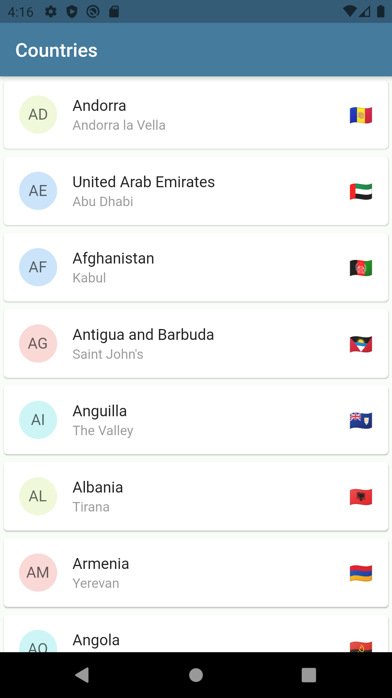
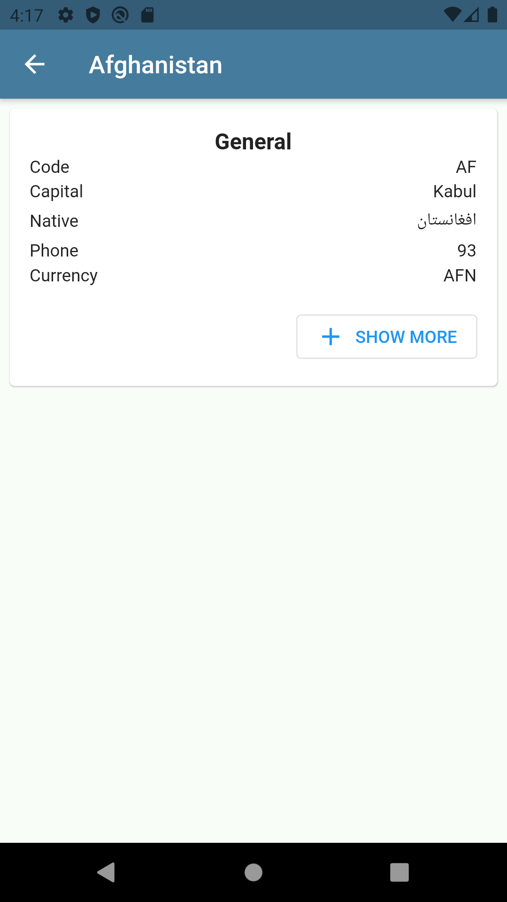
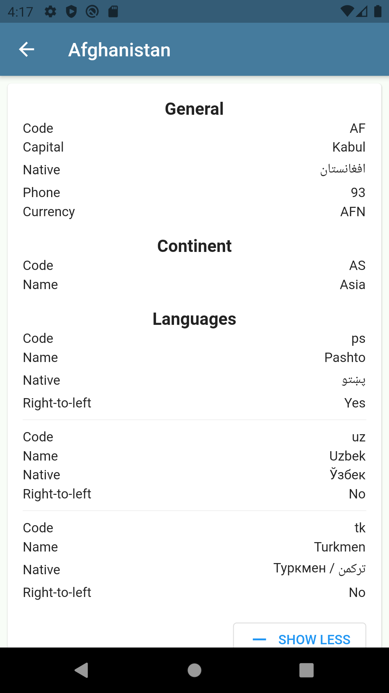

# Countries 🌍

Countries is a Flutter application developed as an assignment for [SafeNow](https://www.safenow.app/).

 

| Countries | Details | Expanded |
| ------ | ----- | ------ |
|  |  |  |

## Tech stack
* [Provider](https://github.com/rrousselGit/provider) for state management
* [GetIt](https://github.com/fluttercommunity/get_it) for dependency injection
* [GraphQL Flutter](https://github.com/zino-app/graphql-flutter) as GraphQL client

## Data source
* [Countries GraphQL API](https://github.com/trevorblades/countries): thanks [@trevorblades](https://github.com/trevorblades) !

